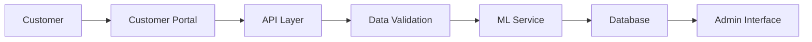
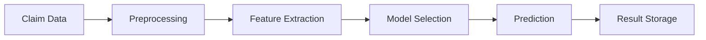

# System Architecture Documentation

This document provides a detailed overview of the Insurance Claims Processing System architecture, including system components, data flow, and deployment architecture.

## System Components

### 1. Core Components
- **Claims Management System**
  - Django-based web application
  - RESTful API using Django REST Framework
  - Role-based access control (Admin, Staff, User)
  - Document management system
  - Real-time status tracking

- **ML Engine**
  - KNN-based fraud detection
  - Automated claim processing
  - Model versioning and management
  - Performance monitoring
  - Automated retraining pipeline

- **Database**
  - PostgreSQL database
  - Document storage (AWS S3)
  - Caching layer (Redis)

### 2. Supporting Systems
- **Authentication System**
  - JWT-based authentication
  - Role-based permissions
  - Session management

- **Document Management**
  - AWS S3 integration
  - Document versioning
  - Secure file storage

- **Monitoring System**
  - Performance metrics
  - Error tracking
  - Usage analytics

## Data Flow

### 1. Claim Submission Flow


### 2. ML Prediction Flow


### 3. User Authentication Flow


## Database Schema

### Claims
```sql
CREATE TABLE claims_claim (
    id SERIAL PRIMARY KEY,
    claim_number VARCHAR(50) UNIQUE,
    policy_number VARCHAR(50),
    claim_type VARCHAR(50),
    description TEXT,
    amount DECIMAL(10,2),
    status VARCHAR(20),
    submission_date TIMESTAMP,
    last_updated TIMESTAMP,
    user_id INTEGER REFERENCES auth_user(id),
    assigned_to INTEGER REFERENCES auth_user(id),
    ml_score DECIMAL(5,2),
    ml_confidence DECIMAL(5,2),
    ml_recommendation VARCHAR(20)
);
```

### Documents
```sql
CREATE TABLE claims_document (
    id SERIAL PRIMARY KEY,
    claim_id INTEGER REFERENCES claims_claim(id),
    document_type VARCHAR(50),
    file_path VARCHAR(255),
    upload_date TIMESTAMP,
    status VARCHAR(20)
);
```

### ML Models
```sql
CREATE TABLE ml_engine_mlmodel (
    id SERIAL PRIMARY KEY,
    name VARCHAR(100),
    version VARCHAR(20),
    model_type VARCHAR(50),
    status VARCHAR(20),
    created_at TIMESTAMP,
    updated_at TIMESTAMP,
    performance_metrics JSONB,
    is_active BOOLEAN
);
```

## ML Model Architecture

### 1. Model Components
- **KNN Implementation**
  ```python
  class KNN:
      def __init__(self, k=1, regression=True):
          self.k = k
          self.regression = regression
          self.X_train = None
          self.y_train = None
  ```

### 2. Feature Engineering
- Numerical features
- Categorical encoding
- Feature scaling
- Feature selection

### 3. Model Training
- Data preprocessing
- Cross-validation
- Hyperparameter tuning
- Model evaluation

### 4. Model Deployment
- Version control
- A/B testing
- Performance monitoring
- Rollback capability

## Deployment Architecture

### 1. Development Environment
- Local development setup
- Docker containers
- Development database
- Testing tools

### 2. Staging Environment
- Staging server
- Test database
- CI/CD pipeline
- Performance testing

### 3. Production Environment
- Load balancer
- Application servers
- Database cluster
- Backup systems

### 4. Monitoring
- Application metrics
- Server metrics
- Database metrics
- Error tracking

## System Requirements

### 1. Hardware Requirements
- CPU: 4+ cores
- RAM: 8GB minimum
- Storage: 100GB minimum
- Network: 1Gbps

### 2. Software Requirements
- Python 3.8+
- PostgreSQL 12+
- Redis 6+
- Nginx 1.18+

### 3. Dependencies
- Django 4.0+
- Django REST framework
- scikit-learn 1.4.2
- pandas 2.2.2

## Scaling Strategy

### 1. Horizontal Scaling
- Load balancer configuration
- Database sharding
- Cache distribution
- Session management

### 2. Vertical Scaling
- Server resources
- Database optimization
- Cache optimization
- Application tuning

### 3. Performance Optimization
- Query optimization
- Caching strategy
- Connection pooling
- Resource management

## Backup and Recovery

### 1. Backup Strategy
- Database backups
- File backups
- Configuration backups
- Log backups

### 2. Recovery Procedures
- Database restoration
- File restoration
- Configuration restoration
- Service recovery

### 3. Disaster Recovery
- Recovery time objectives
- Recovery point objectives
- Failover procedures
- Business continuity 